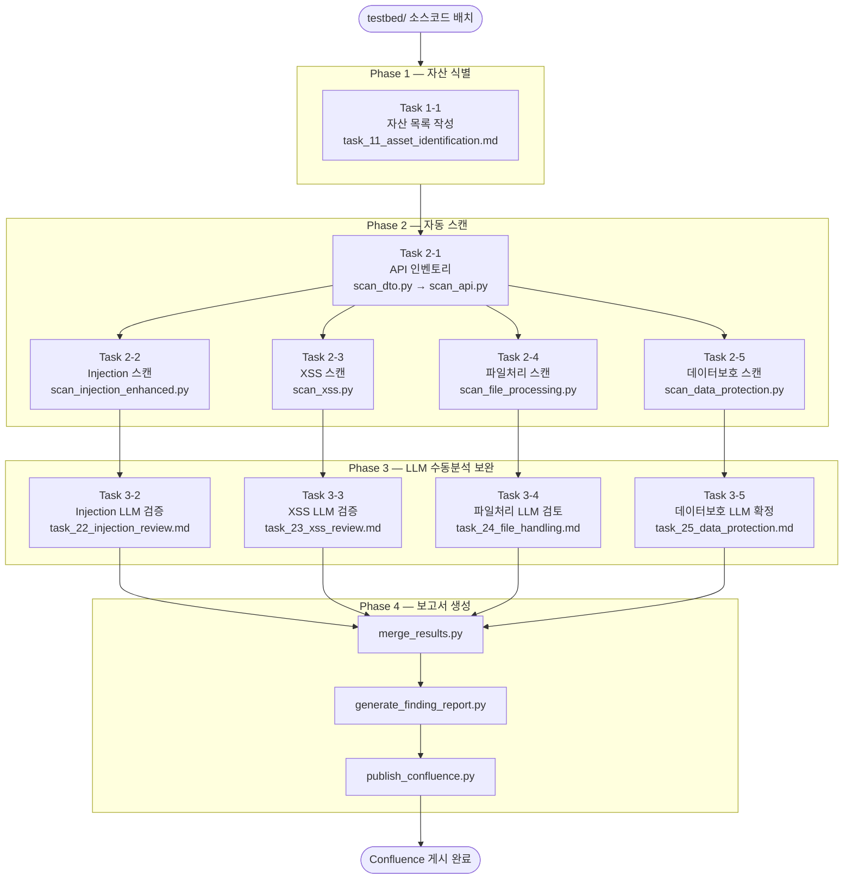

# sec-audit-static 진단 프레임워크 문서

> **이 디렉토리는 `/sec-audit-static` skill의 형상관리 문서 저장소입니다.**
> 스크립트·프롬프트 변경 시 해당 문서도 함께 갱신하십시오.

---

## 문서 목록

| 파일 | 설명 |
|------|------|
| [`README.md`](README.md) | 전체 워크플로 개요 및 인덱스 (이 파일) |
| [`RELEASE_NOTES.md`](RELEASE_NOTES.md) | 버전별 변경 이력 (스크립트 + 프롬프트 통합) |
| [`task-11_asset-identification.md`](task-11_asset-identification.md) | Phase 1 — 자산 식별 |
| [`task-21_api-inventory.md`](task-21_api-inventory.md) | Task 2-1 — API 인벤토리 (`scan_api.py`, `scan_dto.py`) |
| [`task-22_injection.md`](task-22_injection.md) | Task 2-2 — Injection 진단 (`scan_injection_enhanced.py` + LLM) |
| [`task-23_xss.md`](task-23_xss.md) | Task 2-3 — XSS 진단 (`scan_xss.py` + LLM) |
| [`task-24_file-handling.md`](task-24_file-handling.md) | Task 2-4 — 파일처리 진단 (`scan_file_processing.py` + LLM) |
| [`task-25_data-protection.md`](task-25_data-protection.md) | Task 2-5 — 데이터보호 진단 (`scan_data_protection.py` + LLM) |
| [`phase-4_reporting.md`](phase-4_reporting.md) | Phase 4 — 보고서 생성 및 Confluence 게시 |

---

## 전체 워크플로 다이어그램



---

## 산출물 파일 명명 규칙

```
state/<prefix>_dto_catalog.json         ← scan_dto.py 출력
state/<prefix>_api_inventory.json       ← scan_api.py 출력
state/<prefix>_injection.json           ← scan_injection_enhanced.py 출력
state/<prefix>_task22_llm.json          ← LLM 보완 (injection supplemental)
state/<prefix>_xss.json                 ← scan_xss.py 출력
state/<prefix>_task23_llm.json          ← LLM 보완 (xss supplemental)
state/<prefix>_task24.json              ← scan_file_processing.py 출력
state/<prefix>_task24_llm.json          ← LLM 보완 (file handling)
state/<prefix>_task25.json              ← scan_data_protection.py 출력
state/<prefix>_task25_final.json        ← LLM 확정 (data protection final)
state/<prefix>_진단보고서_v2.md         ← generate_finding_report.py 출력
```

---

## 컴포넌트 위치 요약

```
skills/sec-audit-static/
  SKILL.md                              ← skill 진입점 (LLM이 최초 로드)
  references/
    workflow.md                         ← Phase/Task 실행 맵
    injection_diagnosis_criteria.md     ← ORM별 SQL Injection 판정 기준
    cross_verification.md               ← Phase 3 교차검증 절차
    manual_review_prompt.md             ← LLM 수동진단 페르소나·기준
    taint_tracking.md                   ← Source→Sink Taint 추적
    global_filters.md                   ← 전역 필터/인터셉터 검증
    severity_criteria.md                ← 심각도 기준 (Risk 1~5)
    output_schemas.md                   ← JSON 출력 스키마
    task_prompts/
      task_11_asset_identification.md
      task_21_api_inventory.md
      task_22_injection_review.md
      task_23_xss_review.md
      task_24_file_handling.md
      task_25_data_protection.md
    rules/
      semgrep/                          ← Semgrep YAML 룰 7종
      joern/                            ← Joern Scala 쿼리 2종

tools/scripts/
  scan_dto.py                           ← DTO 카탈로그 추출
  scan_api.py                           ← API 인벤토리 추출
  scan_injection_enhanced.py            ← Task 2-2 자동스캔
  scan_injection_patterns.py            ← OS Command/SSI 패턴 라이브러리
  scan_xss.py                           ← Task 2-3 자동스캔
  scan_file_processing.py               ← Task 2-4 자동스캔
  scan_data_protection.py               ← Task 2-5 자동스캔
  merge_results.py                      ← Phase 4 결과 병합
  generate_finding_report.py            ← Phase 4 Markdown 보고서
  publish_confluence.py                 ← Phase 4 Confluence 게시
  validate_task_output.py               ← 스키마 유효성 검증
  redact.py                             ← 민감정보 마스킹
```

---

## 문서 갱신 규칙

> 아래 변경이 발생할 때마다 **반드시 해당 문서와 `RELEASE_NOTES.md`를 함께 갱신**합니다.

| 변경 유형 | 갱신 대상 문서 |
|-----------|---------------|
| 스크립트 정규식·로직 변경 | 해당 `task-XX_*.md` + `RELEASE_NOTES.md` |
| LLM 프롬프트 판정 기준 변경 | 해당 `task-XX_*.md` + `RELEASE_NOTES.md` |
| 신규 취약점 카테고리 추가 | 해당 `task-XX_*.md` + `RELEASE_NOTES.md` |
| 출력 스키마 변경 | `phase-4_reporting.md` + `RELEASE_NOTES.md` |
| Semgrep/Joern 룰 변경 | 해당 `task-XX_*.md` + `RELEASE_NOTES.md` |
| Phase 구조 변경 | `README.md` + `RELEASE_NOTES.md` |
