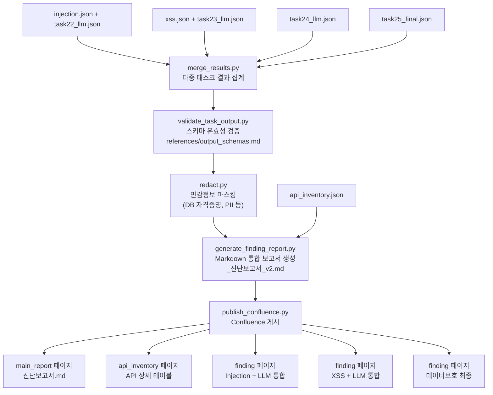

# Phase 4 — 보고서 생성 및 Confluence 게시

> **관련 파일**
> - `tools/scripts/merge_results.py`
> - `tools/scripts/generate_finding_report.py`
> - `tools/scripts/publish_confluence.py`
> - `tools/scripts/validate_task_output.py`
> - `tools/scripts/redact.py`
> - `tools/confluence_page_map.json`
> **최종 갱신**: 2026-03-09

---

## 전체 Phase 4 흐름



---

## 스크립트별 상세

### 1. merge_results.py

```bash
python3 tools/scripts/merge_results.py \
    state/<prefix>_injection.json \
    state/<prefix>_xss.json \
    state/<prefix>_task24_llm.json \
    state/<prefix>_task25_final.json \
    -o state/<prefix>_merged.json
```

- 여러 태스크 결과를 단일 JSON으로 통합
- `result` 통계 집계: 취약/정보/양호 카운트
- `needs_review` 항목 플래그 보존

---

### 2. validate_task_output.py

```bash
python3 tools/scripts/validate_task_output.py \
    state/<prefix>_merged.json \
    --schema skills/sec-audit-static/references/schemas/task_output_schema.json
```

- `references/output_schemas.md` 기준 JSON 스키마 검증
- 필수 필드(`result`, `severity`, `cwe_id` 등) 누락 확인
- 검증 실패 시 오류 목록 출력

---

### 3. redact.py

```bash
python3 tools/scripts/redact.py \
    state/<prefix>_merged.json \
    -o state/<prefix>_redacted.json
```

- DB 자격증명, API 시크릿, PII 값 마스킹
- code_snippet 내 비밀번호 실제 값 → `****` 치환
- Confluence 게시 전 필수 실행

---

### 4. generate_finding_report.py

```bash
python3 tools/scripts/generate_finding_report.py \
    <source_dir> \
    <task22_findings.json> <task22_llm.json> \
    <task23_findings.json> <task23_llm.json> \
    <task24_llm.json> \
    <task25_final.json> \
    --source-label "<서비스명>" \
    --service "<서비스명>" \
    --anchor-style md2cf \
    -o state/<prefix>_진단보고서_v2.md
```

**주의사항:**
- `endpoint_diagnoses` 포맷 파일은 직접 인식 안 됨 → `findings` 포맷으로 변환 필요
- `--anchor-style md2cf`: Confluence 앵커 형식으로 마크다운 생성

---

### 5. publish_confluence.py

```bash
# 게시 전 dry-run 확인
python3 tools/scripts/publish_confluence.py --dry-run

# 특정 항목만 게시
python3 tools/scripts/publish_confluence.py \
    --filter state/<prefix>_진단보고서_v2.md

# 전체 게시
python3 tools/scripts/publish_confluence.py
```

---

## confluence_page_map.json 구조

```json
{
  "next_test_number": 19,
  "entries": [
    {
      "source": "state/<prefix>_진단보고서_v2.md",
      "type": "main_report",
      "title": "테스트NN - 서비스명 진단",
      "task_sources": {
        "api": "state/<prefix>_api_inventory.json",
        "injection": "state/<prefix>_injection.json",
        "xss": "state/<prefix>_xss.json",
        "data_protection": "state/<prefix>_task25_final.json"
      }
    },
    {
      "source": "state/<prefix>_api_inventory.json",
      "type": "api_inventory",
      "title": "테스트NN - API 인벤토리"
    },
    {
      "source": "state/<prefix>_injection.json",
      "type": "finding",
      "title": "테스트NN - 인젝션 취약점 진단 결과",
      "supplemental_sources": ["state/<prefix>_task22_llm.json"]
    },
    {
      "source": "state/<prefix>_xss.json",
      "type": "finding",
      "title": "테스트NN - XSS 취약점 진단 결과",
      "supplemental_sources": ["state/<prefix>_task23_llm.json"]
    },
    {
      "source": "state/<prefix>_task25_final.json",
      "type": "finding",
      "title": "테스트NN - 데이터 보호 진단 결과"
    }
  ]
}
```

---

## Confluence 페이지 유형별 렌더러

| type | 렌더러 함수 | 설명 |
|------|-----------|------|
| `main_report` | `_render_main_report()` | Markdown → Confluence 스토리지 변환, 요약 테이블 포함 |
| `api_inventory` | `_json_to_xhtml_api_inventory()` | 엔드포인트별 파라미터 + DTO 상세 테이블 |
| `finding` | `_json_to_xhtml_finding()` | 카테고리 그룹핑 + Expand 매크로 + supplemental 통합 |

---

## 단일 Finding 페이지 원칙

```
자동스캔 결과 (injection.json)
        +
LLM 보완 결과 (task22_llm.json → supplemental_sources)
        ↓
하나의 Confluence 페이지에 통합 렌더링

⚠️ LLM 보완 결과만 별도 Finding 페이지로 게시 금지
```

---

## 현재 테스트 번호 현황

| 번호 | 서비스 | 상태 |
|------|--------|------|
| 테스트17 | MSG Sugar API | 완료 |
| 테스트18 | OCB Community API | 완료 |
| 테스트19 | — | **다음 진단 예정** |

> `confluence_page_map.json`의 `next_test_number` 값을 게시 후 자동 증가
