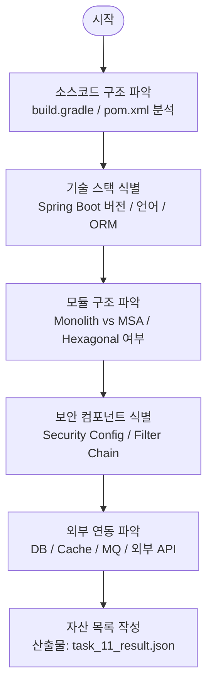

# Task 1-1 — 자산 식별 (Asset Identification)

> **관련 파일**
> - 프롬프트: `skills/sec-audit-static/references/task_prompts/task_11_asset_identification.md`
> **현재 버전**: 수동 분석 (자동화 스크립트 없음)
> **최종 갱신**: 2026-03-09

---

## 목적

진단 대상 시스템의 구성 요소와 기술 스택을 명확히 파악하여 후속 Phase 2 진단의 범위와 방향을 결정합니다.

---

## 실행 흐름



---

## 수집 항목

| 카테고리 | 수집 내용 | 위치 힌트 |
|---------|-----------|-----------|
| 프레임워크 | Spring Boot 버전, Kotlin/Java 여부 | `build.gradle`, `pom.xml` |
| 아키텍처 | Monolith/MSA, Hexagonal 여부 | 패키지 구조 (`domain/`, `port/`, `adapter/`) |
| 데이터 접근 | JPA/MyBatis/JDBC, DB 종류 | `*Repository.java`, `*Mapper.xml`, `application.yml` |
| 보안 설정 | Spring Security Config, Filter Chain | `*SecurityConfig.java`, `WebSecurityConfigurerAdapter` |
| XSS 방어 | Lucy XSS Filter, AntiSamy | `lucy-xss-*.xml`, `WebMvcConfigurer` |
| 인증/인가 | OAuth2, JWT, Session | `application.yml`, `*TokenProvider.java` |
| 외부 연동 | gRPC, Kafka, Redis | `build.gradle`, `*Client.java` |
| 설정 파일 | profiles (dev/real/prod) | `application-*.yml` |

---

## 산출물 구조

```json
{
  "task_id": "1-1",
  "source_dir": "testbed/<project>/",
  "tech_stack": {
    "language": "Kotlin 1.9.23",
    "framework": "Spring Boot 3.2.5",
    "orm": ["JPA", "MyBatis"],
    "db": ["MySQL", "Oracle"],
    "security": ["Spring Security", "OAuth2", "JWT"]
  },
  "modules": ["module-a", "module-b"],
  "architecture": "hexagonal",
  "global_filters": {
    "lucy_xss": true,
    "lucy_multipart_scope": "form-only"
  }
}
```

---

## 다음 단계

Task 1-1 완료 후 Phase 2 진입:
- `tech_stack.orm` 값 → Task 2-2 Injection 진단 기준 결정
- `global_filters.lucy_xss` 값 → Task 2-3 XSS 전역 필터 검증
- `architecture: hexagonal` → scan_injection_enhanced.py `--hexagonal` 옵션 적용
