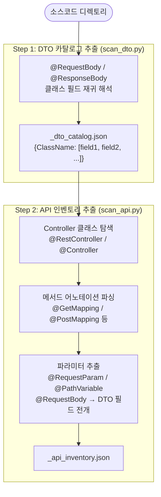

# Task 2-1 — API 인벤토리 (API Inventory)

> **관련 파일**
> - 스크립트: `tools/scripts/scan_dto.py`, `tools/scripts/scan_api.py`
> - 프롬프트: `skills/sec-audit-static/references/task_prompts/task_21_api_inventory.md`
> **최종 갱신**: 2026-03-09

---

## 목적

소스코드에서 모든 HTTP 엔드포인트와 입력 파라미터를 자동 추출합니다.
Task 2-2~2-5 자동 스캔의 **입력 데이터(--api-inventory)**로 사용됩니다.

---

## 실행 흐름



---

## 스크립트 실행 명령

```bash
# Step 1: DTO 카탈로그 추출
python3 tools/scripts/scan_dto.py <source_dir> \
    -o state/<prefix>_dto_catalog.json

# Step 2: API 인벤토리 (DTO 연동)
python3 tools/scripts/scan_api.py <source_dir> \
    --dto-catalog state/<prefix>_dto_catalog.json \
    -o state/<prefix>_api_inventory.json
```

---

## 탐지 대상 어노테이션

| 어노테이션 | 설명 |
|-----------|------|
| `@RestController` | JSON API 컨트롤러 |
| `@Controller` | View 반환 컨트롤러 |
| `@GetMapping`, `@PostMapping`, `@PutMapping`, `@DeleteMapping`, `@PatchMapping` | HTTP 메서드 매핑 |
| `@RequestMapping` | 공통 경로 접두사 |
| `@RequestParam` | 쿼리 파라미터 |
| `@PathVariable` | URL 경로 변수 |
| `@RequestBody` | JSON 요청 본문 (DTO 재귀 전개) |
| `@RequestHeader` | 요청 헤더 |

---

## 산출물 구조 (`api_inventory.json`)

```json
{
  "task_id": "2-1",
  "endpoints": [
    {
      "method": "POST",
      "path": "/api/v1/users",
      "controller": "UserController",
      "handler": "createUser",
      "parameters": [
        {"name": "userId",   "type": "String", "source": "body"},
        {"name": "mbrId",    "type": "String", "source": "body"},
        {"name": "cardNo",   "type": "String", "source": "body"}
      ],
      "return_type": "ResponseEntity<UserResponse>",
      "resolved_fields": ["userId", "mbrId", "cardNo"]
    }
  ]
}
```

---

## 후속 사용

| Task | 사용 방법 |
|------|----------|
| Task 2-2 Injection | `--api-inventory` 옵션으로 endpoint별 HTTP 파라미터 Taint 소스 확인 |
| Task 2-3 XSS | `@RequestParam`, `@RequestBody` 자유텍스트 파라미터 여부 판단 |
| Task 2-4 File Handling | `MultipartFile` 파라미터 포함 엔드포인트 필터링 |
| Task 2-5 Data Protection | DTO 필드 내 PII 노출 여부 (`DTO_EXPOSURE`) 판정 |
| Phase 4 Confluence | `api_inventory` 타입 게시 → 엔드포인트 상세 테이블 렌더링 |
