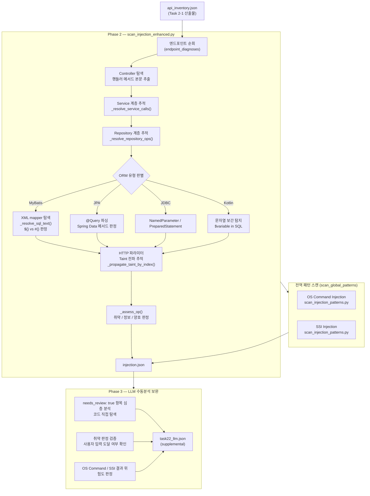
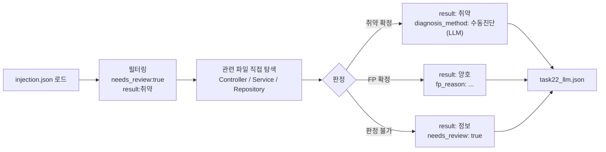

# Task 2-2 — Injection 진단

> **관련 파일**
> - 자동 스캔: `tools/scripts/scan_injection_enhanced.py`
> - 패턴 라이브러리: `tools/scripts/scan_injection_patterns.py`
> - LLM 프롬프트: `skills/sec-audit-static/references/task_prompts/task_22_injection_review.md`
> - 판정 기준: `skills/sec-audit-static/references/injection_diagnosis_criteria.md`
> - 교차검증: `skills/sec-audit-static/references/cross_verification.md`
> **스크립트 버전**: v4.9.3 (2026-03-06)
> **최종 갱신**: 2026-03-09

---

## 진단 항목

| 항목 | CWE | 설명 |
|------|-----|------|
| SQL Injection | CWE-89 | MyBatis `${}`, 문자열 연결, Kotlin 보간, R2DBC Utils.toSql() |
| OS Command Injection | CWE-78 | Runtime.exec(), ProcessBuilder, GroovyShell 등 |
| SSI Injection | CWE-97 | Server-Side Include 구문 삽입 |

---

## 전체 실행 흐름



---

## ORM별 판정 기준

### MyBatis

| 패턴 | 판정 | 설명 |
|------|------|------|
| `#{param}` | 양호 | PreparedStatement 자동 바인딩 |
| `${param}` | **취약** | 문자열 직접 치환 → SQL 삽입 가능 |
| `${param}` in `ORDER BY` / `LIMIT` | **취약** | 동적 정렬·페이징도 위험 |
| `<include refid="..."/>` | 인라인 치환 후 재판정 | `_resolve_sql_text()` |

### JPA / Spring Data JPA

| 패턴 | 판정 | 설명 |
|------|------|------|
| 내장 메서드 (`findById`, `save` 등) | 양호 | 자동 파라미터 바인딩 |
| `@Query("... :param ...")` | 양호 | Named parameter 바인딩 |
| `@Query("... " + param + " ...")` | **취약** | 문자열 연결 |
| `@Query(nativeQuery=true)` | 검토 | Native SQL 동적 여부 확인 |
| `EntityManager.createNativeQuery(str)` | 검토 | 동적 SQL 여부 확인 필요 |

### JDBC / NamedParameterJdbcTemplate

| 패턴 | 판정 | 설명 |
|------|------|------|
| `:param` + `paramMap.put()` | 양호 | Named parameter 바인딩 |
| `?` + `PreparedStatement.setXxx()` | 양호 | Positional 바인딩 |
| `"..." + param + "..."` | **취약** | 문자열 연결 |
| `String.format("...%s...", param)` | **취약** | 포맷 문자열 삽입 |

### Kotlin 문자열 보간

| 패턴 | 판정 | 설명 |
|------|------|------|
| `"$variable"` in SQL | **취약** | 단순 변수 보간 → SQL 직접 삽입 |
| `"${expression}"` in SQL | **취약** | 표현식 보간 |
| `:param` + `paramMap` | 양호 | Named parameter |
| `${if(cond) "A" else "B"}` | 양호 | 키워드 분기 (상수) |

---

## 스크립트 주요 함수 맵

```
scan_injection_enhanced.py
├── scan_endpoints()                    ← 진단 진입점
│   ├── _resolve_controller()           ← Controller 파일 탐색
│   ├── _trace_call_graph()             ← Controller→Service→Repository 추적
│   │   ├── _resolve_service_calls()    ← Service 계층 추적
│   │   └── _resolve_repository_ops()  ← Repository DB 접근 추적
│   ├── _assess_op()                    ← ORM별 취약/정보/양호 판정
│   └── _propagate_taint_by_index()     ← HTTP 파라미터 Taint 전파
├── scan_global_patterns()              ← OS Command/SSI 전역 스캔
│   └── scan_file() (scan_injection_patterns.py)
└── run_scan()                          ← 메인 진입점
```

---

## 산출물 구조

### injection.json (자동스캔)

```json
{
  "task_id": "2-2",
  "endpoint_diagnoses": [
    {
      "no": "2-2-001",
      "check_item": "SQL인젝션",
      "result": "취약",
      "severity": "Risk 5",
      "path": "/api/v1/boards",
      "diagnosis_type": "[실제] SQL Injection - Kotlin 문자열 보간",
      "diagnosis_detail": "...",
      "filter_type": "kotlin",
      "taint_confirmed": true,
      "needs_review": false
    }
  ],
  "global_findings": {
    "os_command_injection": {"total": 2, "findings": [{"severity": "Risk 5", "result": "정보", "...": "..."}]},
    "ssi_injection": {"total": 0, "findings": []}
  }
}
```

### task22_llm.json (LLM 보완 — supplemental)

```json
{
  "task_id": "2-2-llm",
  "supplemental_type": "injection",
  "findings": [
    {
      "endpoint": "POST /api/v1/search",
      "result": "취약",
      "diagnosis_method": "수동진단(LLM)",
      "manual_review_note": "..."
    }
  ]
}
```

---

## Phase 3 LLM 보완 절차



---

## 변경 이력

> 자세한 내용은 [`RELEASE_NOTES.md`](RELEASE_NOTES.md) 참조

| 버전 | 날짜 | 요약 |
|------|------|------|
| v4.9.3 | 2026-03-06 | iBatis namespace 버그 수정, DTO Taint 단절 해결 |
| v4.9.2 | 2026-03-06 | @Query nativeQuery 판정, stringTemplate {0} 안전 구분 |
| v4.9.1 | 2026-03-06 | MyBatis `<include>` 인라인 치환 전면 재작성 |
| v4.6.3 | 2026-02-28 | Call Graph 완성 (Fix A~E) |
| v4.6.0 | 2026-02-25 | Hexagonal Architecture 지원 |
| v4.5.0 | 2026-02-24 | Positional Index Taint Tracking |
| result/severity 필드 | 2026-03-09 | os_command/ssi findings에 result:"정보" + severity:"Risk 5" 주입 |
| severity 등급 표준화 | 2026-03-09 | SQL Injection [실제]→Risk 5, [잠재]→Risk 4; OS Command/SSI→Risk 5 |
