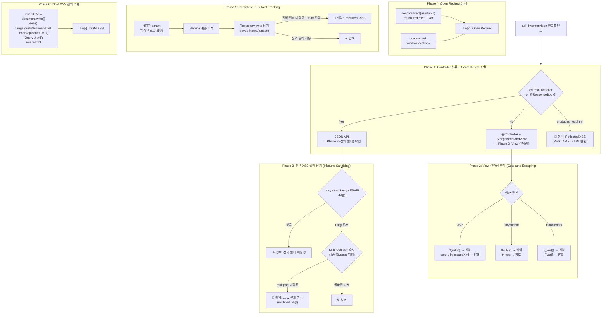
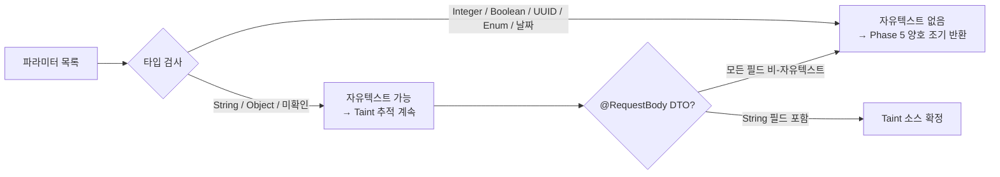

# Task 2-3 — XSS 진단

> **관련 파일**
> - 자동 스캔: `tools/scripts/scan_xss.py`
> - LLM 프롬프트: `skills/sec-audit-static/references/task_prompts/task_23_xss_review.md`
> - 전역 필터: `skills/sec-audit-static/references/global_filters.md`
> **스크립트 버전**: v2.5.0 (2026-03-06)
> **최종 갱신**: 2026-03-09

---

## 진단 항목

| 유형 | CWE | 설명 |
|------|-----|------|
| Reflected XSS | CWE-79 | HTTP 파라미터 → 응답 직접 반영 |
| Persistent XSS | CWE-79 | HTTP 파라미터 → DB 저장 → 조회 시 출력 |
| DOM XSS | CWE-79 | innerHTML, document.write, eval 등 |
| View XSS | CWE-79 | JSP `${}`, Thymeleaf `th:utext`, Handlebars `{{{` |
| Open Redirect | CWE-601 | 사용자 입력 → sendRedirect / location.href |
| XSS Filter 우회 | CWE-79 | Lucy XSS Filter multipart 범위 미흡 |

---

## 6단계 진단 흐름 (scan_xss.py)



---

## 자유텍스트 파라미터 판별 로직

XSS가 성립하려면 공격자가 임의 문자열을 주입할 수 있어야 합니다. 스크립트는 파라미터를 아래 기준으로 필터링합니다.



---

## 스크립트 주요 함수 맵

```
scan_xss.py
├── scan_xss_endpoints()               ← 진단 진입점
│   ├── _check_controller_type()       ← Phase 1: Controller 분류
│   ├── _check_view_rendering()        ← Phase 2: View 렌더링 추적
│   ├── _check_global_xss_filter()     ← Phase 3: 전역 필터 탐지
│   │   └── _check_lucy_multipart()    ← Lucy multipart bypass 검증
│   ├── _check_redirect()              ← Phase 4: Open Redirect
│   ├── check_persistent_xss()         ← Phase 5: Persistent XSS
│   │   ├── _has_freetext_params()     ← 자유텍스트 파라미터 판별
│   │   ├── _inspect_dto_fields()      ← DTO 필드 1레벨 검사 (v2.3.2)
│   │   ├── _resolve_svc_impl_body()   ← Hexagonal: 구현체 해석 (v2.3.1)
│   │   ├── _check_repo_param_context() ← SET vs WHERE 절 구분 (v2.3.0)
│   │   └── _has_param_in_direct_call() ← HTTP 파라미터 직접 전달 확인
│   └── judge_xss_endpoint()           ← Worst-case 최종 판정
└── scan_dom_xss_global()              ← Phase 6: DOM XSS 전역 스캔
```

---

## 판정 결과 카테고리

| result | severity | 조건 |
|--------|----------|------|
| 취약 | High | Reflected XSS: REST API text/html 반환 |
| 취약 | High | View XSS: th:utext / `${}` 미이스케이프 |
| 취약 | High | Persistent XSS: taint 경로 자동 확인 |
| 취약 | Medium | Persistent XSS: DB write 경로 불명 |
| 취약 | High | Open Redirect: 사용자 입력 직접 반영 |
| 취약 | High | Lucy 우회: multipart 요청 필터 미적용 |
| 정보 | Medium | 전역 XSS 필터 미설정 (수동 확인 필요) |
| 양호 | - | 파라미터 없음 / 전역 필터 적용 / 이스케이프 확인 |

---

## 산출물 구조

```json
{
  "task_id": "2-3",
  "endpoint_diagnoses": [
    {
      "no": "2-3-001",
      "check_item": "XSS",
      "result": "취약",
      "severity": "Risk 4",
      "xss_category": "reflected",
      "path": "/api/v1/error",
      "diagnosis_detail": "REST API produces=text/html — 사용자 입력 직접 반환",
      "needs_review": false
    }
  ],
  "global_findings": {
    "dom_xss": {"total": 3, "findings": [...]}
  },
  "filter_status": {
    "lucy_xss": {"found": true, "multipart_safe": false}
  }
}
```

---

## 변경 이력

> 자세한 내용은 [`RELEASE_NOTES.md`](RELEASE_NOTES.md) 참조

| 버전 | 날짜 | 요약 |
|------|------|------|
| v2.5.0 | 2026-03-06 | Context Bleed 차단, Kotlin 파싱, Protobuf 예외 |
| v2.4.0 | 2026-03-06 | mbrId/memberId 로깅 탐지, FP 수정 |
| v2.3.2 | 2026-03-04 | DTO 필드 1레벨 검사 (`_inspect_dto_fields`) |
| v2.3.1 | 2026-03-04 | Worst-case 원칙 강화, persist(new ...) 탐지 |
| v2.3.0 | 2026-03-03 | SET/WHERE 절 구분, Hexagonal 아키텍처 지원 |
| v2.2.0 | 2026-03-03 | Persistent XSS 무조건 취약 승급 |
| v2.1.0 | 2026-03-03 | FP 3종 수정 (JPA READ, Enum, AuthPrincipal) |
| v2.0.0 | 2026-03-03 | Phase 5 Taint Tracking 전면 강화 |
| v1.1.0 | 2026-02-26 | per-type 판정, Phase 6 DOM XSS |
