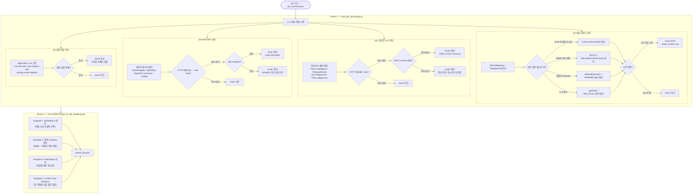

# Task 2-4 — 파일처리 진단 (File Handling)

> **관련 파일**
> - 자동 스캔: `tools/scripts/scan_file_processing.py`
> - LLM 프롬프트: `skills/sec-audit-static/references/task_prompts/task_24_file_handling.md`
> **스크립트 버전**: v1.0.0 (2026-03-06)
> **최종 갱신**: 2026-03-09

---

## 진단 항목

| 카테고리 | CWE | 설명 |
|---------|-----|------|
| `[U]` 파일 업로드 | CWE-434 | UUID 난수화, Tika MIME 검증, 확장자 Whitelist, 크기 제한 |
| `[D]` 파일 다운로드/LFI | CWE-22 | HTTP 파라미터 → 파일 API Taint, Path Traversal 필터 |
| `[R]` RFI/SSRF | CWE-918 | 사용자 입력 → 외부 요청 URL Whitelist |
| `[C]` 설정 파일 | CWE-16 | max-file-size, multipart 전역 설정 |

---

## 진단 흐름



---

## 업로드 보안 체크리스트

| 검증 항목 | 탐지 패턴 | 미적용 시 위험 |
|----------|-----------|---------------|
| **UUID 파일명 난수화** | `UUID.randomUUID()` | 예측 가능한 파일명으로 직접 접근 |
| **MIME 타입 검증** | `Tika`, `Files.probeContentType()` | 확장자만 변경한 악성 파일 업로드 |
| **확장자 Whitelist** | `allowedExtension`, `.endsWith('.jpg')` | 임의 확장자 업로드 (WebShell 등) |
| **파일 크기 제한** | `.getSize()`, `MAX_FILE_SIZE` | DoS 공격 (대용량 파일) |
| **저장 경로 분리** | `uploadPath`, `storageDir` | WebRoot 내 직접 실행 위험 |

---

## LLM 프롬프트 4개 템플릿

| 템플릿 | 목적 | 핵심 확인 포인트 |
|--------|------|----------------|
| T1 IDOR/BOLA | 파일 소유자 검증 | `findById` 후 `userId` 일치 확인 여부 |
| T2 Upload Bypass | MIME + 확장자 이중 검증 | `Tika.detect()` + `allowedExtension` 동시 적용 |
| T3 Sanitization | 파일명/경로 정규화 | `..`, `/`, `\` 필터링 + `normalize()` |
| T4 View Resolver LFI | 뷰 이름 경로 주입 | `return "../../etc/passwd"` 가능 여부 |

---

## 산출물 구조

### task24.json (자동스캔)

```json
{
  "task_id": "2-4",
  "findings": [
    {
      "category": "UPLOAD",
      "result": "취약",
      "severity": "Critical",
      "title": "파일 업로드 검증 미흡 (웹쉘 업로드 위험)",
      "file": "FileUploadController.java",
      "line": 42,
      "missing_checks": ["tika_mime", "ext_whitelist"],
      "needs_review": true
    }
  ],
  "config_findings": [
    {
      "category": "CONFIG",
      "result": "정보",
      "title": "multipart max-file-size 미설정"
    }
  ]
}
```

### task24_llm.json (LLM 보완)

```json
{
  "task_id": "2-4-llm",
  "findings": [
    {
      "endpoint": "POST /api/v1/files/upload",
      "template": "T2_upload_bypass",
      "result": "취약",
      "diagnosis_detail": "MIME 검증 없이 확장자만 검사 — Content-Type 조작으로 우회 가능"
    }
  ]
}
```

---

## 변경 이력

| 버전 | 날짜 | 요약 |
|------|------|------|
| v1.0.0 | 2026-03-06 | 초기 구현 — Upload/Download/LFI/RFI/Config 4카테고리 |
