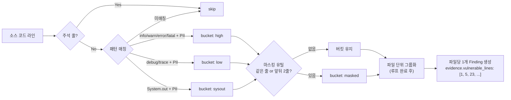

# Task 2-5 — 데이터보호 진단 (Data Protection)

> **관련 파일**
> - 자동 스캔: `tools/scripts/scan_data_protection.py`
> - LLM 프롬프트: `skills/sec-audit-static/references/task_prompts/task_25_data_protection.md`
> **스크립트 버전**: v1.2.0 (2026-03-09)
> **최종 갱신**: 2026-03-12

---

## 진단 항목 (7개 카테고리)

| ID | 카테고리 | CWE | 설명 | Risk |
|----|---------|-----|------|------|
| `[S]` | HARDCODED_SECRET | CWE-798 / CWE-312 | AWS/GCP 키(Critical), DB PW(High), JWT Secret(High) | Risk 5~4 |
| `[L]` | SENSITIVE_LOGGING | CWE-532 | info/fatal 레벨 PII 로깅(Critical), debug/trace(Medium) | Risk 5 / 3 |
| `[C]` | WEAK_CRYPTO | CWE-327 / CWE-916 | MD5/SHA-1/DES/RC4/ECB 모드(Medium), NoOpPasswordEncoder(Critical) | Risk 3 / 5 |
| `[J]` | JWT_INCOMPLETE | CWE-347 / CWE-613 | parseUnsecuredClaims/alg=none(Critical), 서명키 미설정(Critical), clock skew(Medium) | Risk 5 / 3 |
| `[D]` | DTO_EXPOSURE | CWE-200 | Response DTO 내 PII 필드 @JsonIgnore 미적용(High/Medium) | Risk 4~3 |
| `[R]` | CORS_MISCONFIG | CWE-942 | allowedOrigins("*") + allowCredentials(true) 동시 설정(Medium) | Risk 3 |
| `[H]` | SECURITY_HEADER | CWE-693 | .headers().disable(), frameOptions().disable() 등(Medium) | Risk 3 |

---

## 전체 진단 흐름

```mermaid
flowchart TD
    SRC([소스코드 디렉토리]) --> SCAN

    subgraph AUTO["Phase 2 — scan_data_protection.py v1.1.0"]
        SCAN --> S & L & C & J & D & R & H

        subgraph S["[S] HARDCODED_SECRET"]
            S1["Java/Kotlin 소스 스캔\nAWS AKIA / GCP private_key\nJWT secretKey / DB password\nGeneric API Key"]
            S2["설정 파일 스캔\n*.properties / *.yml / *.yaml\npassword/secret/token 평문 탐지"]
            S3{"값이 환경변수 참조\n$\\{...\\} or ENC(...)?"}
            S2 --> S3
            S3 -->|No| VUL_S["result: 취약, severity: Critical"]
            S3 -->|Yes| SAFE_S["제외 (안전 참조)"]
        end

        subgraph L["[L] SENSITIVE_LOGGING (v1.1.0 개선)"]
            L1["log.info/warn/error/fatal\n+ PII 변수 패턴 탐지"]
            L2["log.debug/trace\n+ PII 변수 패턴 탐지"]
            L3{"마스킹 유틸\n근접 사용?"}
            L1 --> L3
            L2 --> L3
            L3 -->|No, info/fatal 레벨| VUL_L["result: 취약\nseverity: Critical\n파일당 1 Finding"]
            L3 -->|No, debug/trace 레벨| INFO_L["result: 정보\nseverity: Medium\n파일당 1 Finding"]
            L3 -->|Yes| MASKED_L["result: 정보\n수동확인 필요"]
            VUL_L & INFO_L & MASKED_L --> GROUP["evidence.vulnerable_lines[]\n라인 번호 배열로 기록"]
        end

        subgraph C["[C] WEAK_CRYPTO"]
            C1["MessageDigest MD5/SHA-1"]
            C2["Cipher DES/3DES/RC4/SEED/ECB\n(RSA/ECB/OAEP 제외)"]
            C3["NoOpPasswordEncoder\nMd5PasswordEncoder"]
        end

        subgraph J["[J] JWT_INCOMPLETE"]
            J0{"JWT 라이브러리\nimport 존재?"}
            J0 -->|No| SKIP_J["스캔 skip (FP 방지)"]
            J0 -->|Yes| J1["parseUnsecuredClaims\nalgorithm('none')\nsetSigningKey 없는 parser\nclock skew ≥ 600초"]
        end

        subgraph D["[D] DTO_EXPOSURE"]
            D1["Response DTO 파일 탐색\n*Dto.java / *Response.java"]
            D2["PII 필드명 탐지\nmbrId / cardNo / ssn 등"]
            D3{"@JsonIgnore\nor @JsonView\nor @JsonSerialize?"}
            D2 --> D3
            D3 -->|없음| VUL_D["result: 취약"]
            D3 -->|있음| SAFE_D["result: 양호"]
        end

        subgraph R["[R] CORS_MISCONFIG"]
            R1["allowedOrigins('*')"]
            R2["allowedOriginPatterns('*')"]
            R3["allowCredentials(true)"]
            R1 & R2 --> CORS_CHK{"allowCredentials\n동시 설정?"}
            CORS_CHK -->|Yes| VUL_R["result: 취약\nseverity: Medium"]
            CORS_CHK -->|No| INFO_R["result: 정보"]
        end

        subgraph H["[H] SECURITY_HEADER"]
            H1[".headers().disable()"]
            H2["frameOptions().disable()\n→ Clickjacking 방어 비활성화"]
            H3["CSP 미설정 확인"]
        end
    end

    AUTO --> OUT1["task25.json"]
    OUT1 --> LLM

    subgraph LLM["Phase 3 — LLM 수동분석 (task_25_data_protection.md)"]
        LA["Step 1: needs_review:true 항목 판정\n케이스 A/B/C (manual_review_prompt.md)"]
        LB["Step 2: 관리자 페이지 분리 여부\nhasIpAddress / 별도 WAS 여부"]
        LC["Step 3: CORS 심층 확인\nOrigin 우회 가능성"]
        LD["Step 4: DTO 민감 필드 직렬화 우회 확인"]
        LE["Step 5: HARDCODED_SECRET 파일/환경 단위 병합\n운영 자격증명 확정 → Critical 상향"]
        LF["Step 6: SENSITIVE_LOGGING 심각도 단위 병합\nCritical 1건 + Medium 1건 + FP 컨설턴트 노트"]
        LA & LB & LC & LD --> LE & LF --> OUT2["task25_llm.json\n(병합·확정 findings 전체)"]
    end
```



---

## PII 변수명 패턴 (`_PII_VAR_NAMES`)

```
ci, di, mdn, ssn, mbrId, memberId, memNo, mbrNo
residentNo, jumin, rrn, birth, birthDate
pwd, password, passwd
cardNo, creditCard, cvc, cvv, pan
tel, phone, mobile
email
addr, address
auth, token, jwt, accessToken, refreshToken
pin, pinCode
rsaKey, privateKey, secretKey
accountNo, bankAccount
```

---

## SENSITIVE_LOGGING 탐지 로직 (v1.1.0 상세)



**파일당 Finding 수:**
- `high` 버킷 → finding 1개 (`result: 취약`, `severity: Critical`)
- `low` 버킷 → finding 1개 (`result: 정보`, `severity: Medium`)
- `sysout` 버킷 → finding 1개 (`result: 정보`, `severity: Info`)
- `masked` 버킷 → finding 1개 (`result: 정보`, 수동확인)

---

## WEAK_CRYPTO 탐지 패턴

| 패턴 | 탐지 대상 | 예외 |
|------|----------|------|
| `MessageDigest.getInstance("MD5")` | 취약 해시 | - |
| `MessageDigest.getInstance("SHA-1")` | 취약 해시 | - |
| `Cipher.getInstance("DES/...")` | 취약 블록 암호 | - |
| `Cipher.getInstance("DESede/...")` | 취약 블록 암호 | - |
| `Cipher.getInstance("RC4")` | 취약 스트림 암호 | - |
| `Cipher.getInstance("SEED/ECB/...")` | 국산 SEED + ECB | - |
| `Cipher.getInstance(".../ECB/...")` | ECB 모드 | `RSA/ECB/OAEP*` 제외 |
| `NoOpPasswordEncoder.getInstance()` | 평문 저장 | - |
| `DigestUtils.md5(...)` | Apache MD5 유틸 | - |

---

## 산출물 구조

### task25.json (자동스캔 원본 — 수정 금지, 증적 보존)

개별 탐지 건수 그대로 저장. 병합 전 원본 데이터.

```json
{
  "task_id": "2-5",
  "findings": [
    {
      "finding_id": "DATA-LOG-001",
      "category": "SENSITIVE_LOGGING",
      "severity": "Critical",
      "result": "취약",
      "title": "민감정보(PII) 평문 로깅 — 1건 (UserService.java)",
      "file": "service/UserService.java",
      "line": 42,
      "code_snippet": "log.info(\"mbrId={}\", mbrId)",
      "cwe_id": "CWE-532",
      "evidence": {
        "vulnerable_lines": [42, 87, 103, 145, 201],
        "sample_count": 5
      }
    }
  ],
  "summary": {
    "total": 222,
    "by_category": {"SENSITIVE_LOGGING": 197, "HARDCODED_SECRET": 23, "WEAK_CRYPTO": 2}
  }
}
```

### task25_llm.json (LLM 병합·확정 — Confluence 게시 소스)

자동스캔 개별 건수를 병합하여 보고서 단위로 통합한 최종 결과.

**HARDCODED_SECRET 병합 결과 (예시: 23건 → 8건):**

| ID | 병합 그룹 | 원본 건수 | 심각도 |
|---|---|---|---|
| DATA-SEC-001 | 운영 Java/Kotlin 소스 내 API Key | 1건 | **Critical** |
| DATA-SEC-002 | 운영 Java/Kotlin 소스 내 HMAC/JWT Key | 1건 | **Critical** |
| DATA-SEC-003 | `resources/config.properties` (운영 공통) | 8건 | High |
| DATA-SEC-004 | `resources/rabbitmq*.properties` (운영 MQ) | 2건 | High |
| DATA-SEC-005 | `resources-ccdev/config_override.properties` | 5건 | Medium |
| DATA-SEC-006 | `resources-ccdev/{rabbitmq,jdbc}.properties` | 3건 | Medium |
| DATA-SEC-007 | `resources-ccalp/config_override.properties` | 2건 | High |
| DATA-SEC-008 | `resources-local-osx/jdbc.properties` | 1건 | Low |

**SENSITIVE_LOGGING 병합 결과 (예시: 197건 → 2건):**

| ID | 버킷 | 원본 건수 | 심각도 | 결과 |
|---|---|---|---|---|
| DATA-LOG-001 | `info/warn/error/fatal` PII 로깅 | 117건 | **Critical** | 취약 |
| DATA-LOG-002 | `debug/trace` PII 로깅 | 80건 | **Medium** | 정보 |

```json
{
  "task_id": "2-5",
  "findings": [
    {
      "id": "DATA-SEC-001",
      "title": "API Key 하드코딩 — CoinConstants.java",
      "severity": "Critical",
      "category": "HARDCODED_SECRET",
      "description": "(LLM 확정) 소스코드 내 API Key 평문 상수 하드코딩.",
      "evidence": {
        "file": "src/main/java/.../constants/CoinConstants.java",
        "lines": "45",
        "code_snippet": "// 45: public static final String OCBX_API_KEY = \"****\";"
      },
      "cwe_id": "CWE-798",
      "owasp_category": "A02:2021 Cryptographic Failures",
      "diagnosis_method": "자동스캔(SAST) + 수동진단(LLM)",
      "result": "취약",
      "needs_review": false,
      "manual_review_note": "[케이스 A 자동 확정] src/main/java — 운영 코드 경로. 운영 키 확정. Critical 상향.",
      "recommendation": "@Value(\"${api.key}\") 또는 Vault/KMS 이관."
    },
    {
      "id": "DATA-LOG-001",
      "title": "운영 환경(info/error) 로그 내 PII 평문 노출 — 117건 병합",
      "severity": "Critical",
      "category": "SENSITIVE_LOGGING",
      "description": "info/error 레벨 로그에 mbrId/mdn 등 PII 마스킹 없이 출력.",
      "evidence": {
        "file": "GameHandler.java 외 다수 (총 117건)",
        "lines": "93 외",
        "code_snippet": "log.info(\"mbrId={}, uuid={}\", mbrId, uuid);\n// (※ 컨설턴트 Note: FP 가능성 있는 항목 명시)"
      },
      "cwe_id": "CWE-532",
      "result": "취약"
    }
  ],
  "consolidation_note": "자동스캔 N건을 파일/심각도 단위로 병합. 원본 findings는 task25.json 증적 보존.",
  "data_protection_assessment": {
    "hardcoded_secret_consolidated_count": 8,
    "hardcoded_secret_original_findings": 23,
    "sensitive_logging_critical_count": 117,
    "sensitive_logging_info_count": 80,
    "sensitive_logging_consolidated_count": 2
  }
}
```

---

## 변경 이력

| 버전 | 날짜 | 요약 |
|------|------|------|
| v1.3.1 | 2026-03-16 | Step 5 케이스 A 강화: src/main/java 경로 → needs_review: false + Critical 자동 확정 (권고→강제); Step 6 low 버킷 severity Info→Medium (v4.9.5 스크립트 기준 반영); 예시 DATA-SEC-001 severity High→Critical; DATA-LOG-002 severity Info→Medium |
| v1.3.0 | 2026-03-12 | Phase 3 병합 단계 추가: HARDCODED_SECRET 파일/환경 단위 8그룹, SENSITIVE_LOGGING 심각도 2그룹; task25_llm.json 병합 출력 구조 공식화; FP 컨설턴트 노트 기재 기준 추가 |
| v1.2.0 | 2026-03-09 | severity 공식 등급 전면 적용: SENSITIVE_LOGGING Critical/Medium, WEAK_CRYPTO Medium, JWT parseUnsecuredClaims Critical, CORS Medium |
| v1.1.0 | 2026-03-09 | 로그 레벨 차등화, 파일단위 그룹화, SEED/ECB 추가, 프로퍼티 token 키워드, JWT import 체크 확인 |
| v1.0.0 | 2026-03-06 | 초기 구현 — 7개 카테고리 |
